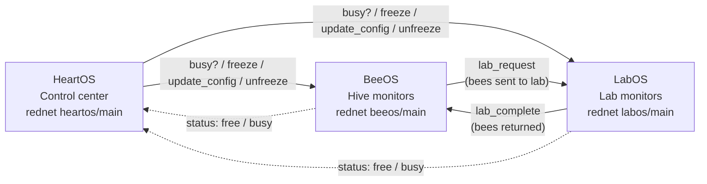

[English](README.md) | [Русский](README.ru.md)

```bash
wget run https://raw.githubusercontent.com/nikitroni/HiveOS/main/installer.lua
```

One command. Installer asks for role (BeeOS / LabOS / HeartOS) and downloads everything.


# HiveOS

A three-terminal ComputerCraft suite that automates bees, genetics and hives in All the Mods 10.


## 🐝 What is HiveOS

HiveOS is a management layer for a bee farm built around a ComputerCraft network. It splits the work across three dedicated terminals instead of one overloaded computer: one terminal watches the hives, one runs the genetics lab, and one is the control center that writes and pushes configurations.

The system is designed for **All the Mods 10 (ATM10)** and its bee ecosystem (Productive Bees, Advanced Peripherals, Just Dire Things and friends), but the architecture is generic: all machine names come from configuration, and the heavy layout data lives in normal Lua tables, so the suite can be adapted to other modpacks with similar blocks.

Every terminal communicates over wireless rednet with a small request/reply protocol, so you can place them anywhere in the base and rewire the farm by editing the config on the control terminal rather than editing scripts.

## 🖥️ Architecture

HiveOS is intentionally split into three roles. **HeartOS** is the control center: it owns the device registry (`device_types.lua`), validates and stores the config files, and talks to the other terminals. **BeeOS** owns the hive screens and the async reader that inspects every hive. **LabOS** owns the breeding and genetics pipeline plus four button monitors.

Configuration changes follow the same pattern for BeeOS and LabOS. HeartOS first asks the terminal whether it is free (`busy?` / `status`); if the terminal is busy running a job it answers `wait` and the edit is refused. Otherwise HeartOS sends `freeze`, the terminal shows its wait screen, HeartOS pushes `update_config`, and finally sends `unfreeze`. Each step expects an explicit acknowledgement (`frozen`, `config_updated`, `running`).

To keep the user interface responsive, long-running work never touches the render loop. BeeOS reads hives through an asynchronous worker (`HiveReader`) that survives a hanging `getBlockData`, while LabOS runs breeding, gene production and upgrades in a separate task worker. Results are delivered as rednet events, so a stuck peripheral never freezes the screen.

A visual map of the network, including the bee hand-off from hive to lab, is shown below and expanded in [`docs/systems.md`](docs/systems.md).



## 📦 Requirements

- **All the Mods 10 (ATM10)** as the base modpack, or a pack with the mods below.
- **ComputerCraft: Tweaked** — the three computers and their monitors.
- **Advanced Peripherals** — Block Readers and the chat box.
- **Productive Bees** — hives, breeding chamber, incubator, gene indexer.
- **Just Dire Things** — the clicker used to drive breeding automation.
- **Modular Routers** — item routing around the lab and hives.
- **Applied Energistics 2 (AE2)** — the resource interface that feeds honey treats.
- **SuperFactoryManager (SFM)** — automation glue for larger farms.
- **Ender IO** — conduits, power and machines around the farm.
- **Item Collectors (or equivalent)** — pickup and routing of drops.

Each terminal needs a **wireless modem** (advanced computer recommended). The mod list may grow as the project is adapted to new packs.

## 🚀 Installation

1. Craft and place **three computers** with their monitors: one for HeartOS, one for BeeOS, one for LabOS.
2. Attach a **wireless modem** to each computer and place the monitors where you want them.
3. On each computer run `wget run https://raw.githubusercontent.com/nikitroni/HiveOS/main/installer.lua`.
4. Pick the **role** when the installer asks (BeeOS / LabOS / HeartOS) and let it download the files.
5. Run `reboot` on BeeOS and LabOS, then start the **wizard on HeartOS** to scan and configure the devices.

Full step-by-step instructions, including cable and monitor placement, are in [`docs/setup.md`](docs/setup.md).

## 🔧 Key systems

- **Breeding** — LabOS drives a breeding chamber and an incubator through a fixed 3-cycle recipe, feeding sunflowers, cages and honey treats, then fires a Just Dire Things clicker to return the parents to the lab chest.
- **Hive map** — HeartOS renders a paginated grid of every hive (48 per page, in three layout groups of 16) with live status colors, and can pulse the relay of a selected hive so you can find it in the world.
- **Genetics** — LabOS reads genes from the indexer, tops up missing ones via a redstone relay, and upgrades bees in crafters + incubator until they reach the elite target values.

Details for all three systems are in [`docs/systems.md`](docs/systems.md).

## 📸 Screenshots

> Placeholders below. See [`docs/screenshots/README.md`](docs/screenshots/README.md) for what each image must show and how to replace the URLs with real captures.


*HeartOS control center — Configure BeeOS / LabOS / Hive and the gene Library.*


*BeeOS tech monitor — the paginated hive list with live status.*


*LabOS breeding screen — cycle progress and the upgrade log.*

## 🗺️ Roadmap

- **v1.0** — three terminals, hive map, breeding, genetics, installer and configuration wizard (done).
- **v2.0 (goal)** — a portable management terminal instead of chat, and a universal hive map that adapts to any layout.
- **v1.x** — flexible small quality-of-life improvements.

The detailed roadmap is in [`docs/roadmap.md`](docs/roadmap.md).

## 📄 License

Released under the MIT License. See [`LICENSE`](LICENSE).

## 🙏 Credits

- Built with [Kilo Code](https://kilo.ai).
- Designed for **All the Mods 10 (ATM10)**.
- Thanks to the authors of CC:Tweaked, Advanced Peripherals, Productive Bees, Just Dire Things, Modular Routers, AE2, SuperFactoryManager (SFM), Ender IO and Item Collectors.
