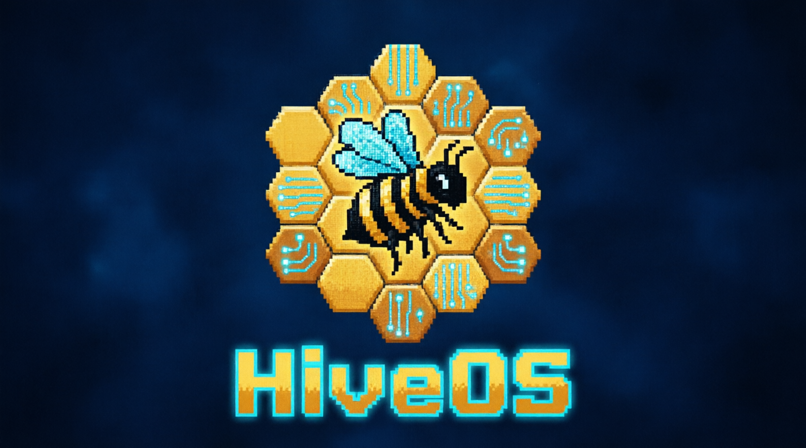
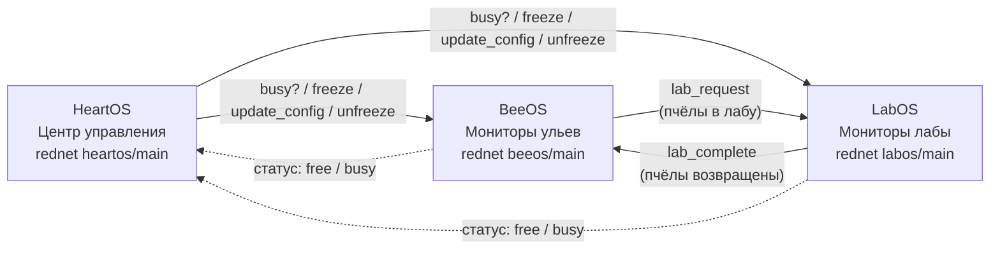

[English](README.md) | [Русский](README.ru.md) | [Docs](docs/)

```bash
wget run https://raw.githubusercontent.com/nikitroni/HiveOS/main/installer.lua
```

Одна команда. Установщик спросит роль (BeeOS / LabOS / HeartOS) и скачает всё необходимое.



# HiveOS

Набор из трёх терминалов для ComputerCraft, автоматизирующий пчёл, генетику и ульи в All the Mods 10.


## 🐝 Что такое HiveOS

HiveOS — это слой управления пасекой, построенный вокруг сети ComputerCraft. Работа делится между тремя отдельными терминалами вместо одного перегруженного компьютера: один следит за ульями, второй ведёт генетическую лабораторию, третий — центр управления, который создаёт и рассылает конфигурации.

Система рассчитана на **All the Mods 10 (ATM10)** и её пчёл (Productive Bees, Advanced Peripherals, Just Dire Things и другие), но архитектура универсальна: все имена блоков берутся из конфигов, а тяжёлые данные раскладки хранятся в обычных Lua-таблицах, поэтому набор можно адаптировать под другие сборки с похожими блоками.

Все терминалы общаются по беспроводному rednet небольшим протоколом «запрос/ответ», так что их можно расставить где угодно и перестроить пасеку правкой конфига на центральном терминале, а не редактированием скриптов.

## 🖥️ Архитектура

HiveOS намеренно разделён на три роли. **HeartOS** — центр управления: он владеет реестром устройств (`device_types.lua`), проверяет и хранит конфиги и общается с остальными терминалами. **BeeOS** владеет экранами ульев и асинхронным читателем, который опрашивает каждый улей. **LabOS** владеет конвейером разведения и генетики, а также четырьмя мониторами-кнопками.

Изменение конфигурации для BeeOS и LabOS идёт по одной схеме. Сначала HeartOS спрашивает, свободен ли терминал (`busy?` / `status`); если терминал занят задачей, он отвечает `wait`, и правка отклоняется. Иначе HeartOS шлёт `freeze`, терминал показывает экран ожидания, HeartOS присылает `update_config` и затем `unfreeze`. Каждый шаг ждёт явного подтверждения (`frozen`, `config_updated`, `running`).

Чтобы интерфейс оставался отзывчивым, долгие операции никогда не касаются цикла отрисовки. BeeOS читает ульи через асинхронный воркер (`HiveReader`), который переживает зависший `getBlockData`, а LabOS выполняет разведение, производство генов и апгрейды в отдельном потоке задач. Результаты приходят событиями rednet, поэтому зависшая периферия никогда не замораживает экран.

Схема сети, включая передачу пчёл из улья в лабораторию, показана ниже и подробно разобрана в [Документации систем](docs/systems.md).



## 📦 Требования

- **All the Mods 10 (ATM10)** как базовая сборка либо сборка с модами ниже.
- **ComputerCraft: Tweaked** — основа проекта.
- **Advanced Peripherals** — дополнительные устройства.
- **Productive Bees** — ПЧЁЛЫ!!!
- **Just Dire Things** — автоматизация разведения.
- **Modular Routers** — маршрутизация предметов вокруг лаборатории.
- **Applied Energistics 2 (AE2)** — интерфейс для подачи ресурсов.
- **SuperFactoryManager (SFM)** — автоматизация для больших пасек.
- **Ender IO** — крафтеры для генов.
- **Item Collectors (или аналог)** — сбор и маршрутизация дропа.

Каждому терминалу нужен **беспроводной модем** (рекомендуется продвинутый компьютер). Список модов может расширяться по мере адаптации под новые сборки.

## 🚀 Установка

1. Создай и поставь **три компьютера** с мониторами: для HeartOS, BeeOS и LabOS.
2. Подключи **беспроводной модем** к каждому компьютеру и размести мониторы там, где нужно.
3. На каждом компьютере выполни `wget run https://raw.githubusercontent.com/nikitroni/HiveOS/main/installer.lua`.
4. Выбери **роль**, которую спросит установщик (BeeOS / LabOS / HeartOS), и дай скачать файлы.
5. Выполни `reboot` на BeeOS и LabOS, затем запусти **мастер на HeartOS** для сканирования и настройки устройств.

Пошаговая инструкция с подключением кабелей и мониторов — в [Инструкции по установке](docs/setup.md).

## 🔧 Ключевые системы

- **Разведение** — LabOS проводит камеру разведения и инкубатор через фиксированный цикл из 3 разведений, подавая подсолнухи, клетки и медовые лакомства, после чего импульсом Just Dire Things возвращает родителей в лабораторный сундук.
- **Карта ульев** — HeartOS рисует постраничную сетку всех ульев (48 на страницу, тремя группами по 16) с живыми цветами статуса и умеет пульсировать реле выбранного улья, чтобы найти его в мире.
- **Генетика** — LabOS читает гены из индексатора, добирает недостающие через редстоун-реле и улучшает пчёл в крафтерах и инкубаторе до элитных значений.

Подробности всех трёх систем — в [Документации систем](docs/systems.md).

## 📸 Скриншоты

> Ниже заглушки. Инструкция по скриншотам — в [Гайде по скриншотам](docs/screenshots/README.md).


*Центр управления HeartOS — Configure BeeOS / LabOS / Hive и библиотека генов.*


*Технический монитор BeeOS — постраничный список ульев с живым статусом.*


*Экран разведения LabOS — прогресс цикла и лог улучшений.*

## 🗺️ План развития

- **v1.0** — три терминала, карта ульев, разведение, генетика, установщик и мастер настройки (готово).
- **v1.x** — гибкие небольшие улучшения удобства.
- **v2.0 (цель)** — портативный терминал управления вместо чата и универсальная карта ульев под любое расположение.

Подробный план — в [Плане развития](docs/roadmap.md).

## 📄 Лицензия

Распространяется под лицензией MIT. См. [Лицензию MIT](LICENSE).

## 🙏 Благодарности

- Создано с помощью [Kilo Code](https://kilo.ai).
- Спроектировано под **All the Mods 10 (ATM10)**.
- Спасибо авторам CC:Tweaked, Advanced Peripherals, Productive Bees, Just Dire Things, Modular Routers, AE2, SuperFactoryManager (SFM), Ender IO и Item Collectors.
