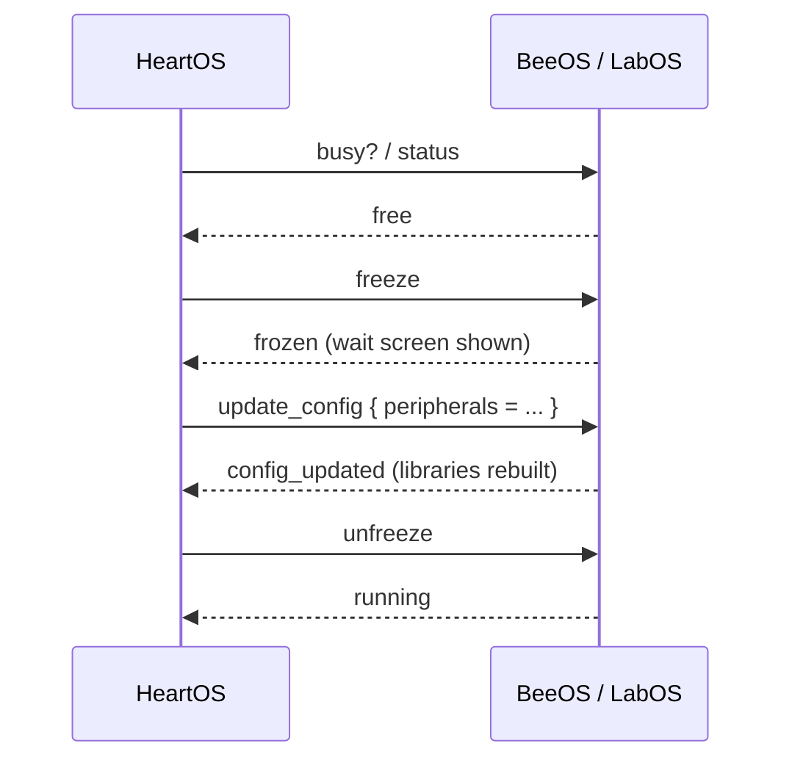

[English](systems.md) | [Русский](systems.ru.md)

# HiveOS — Systems

This document describes the three internal systems of HiveOS: the terminal architecture, the breeding pipeline and the hive map.

- [Architecture](#architecture)
- [Breeding](#breeding)
- [Hive Map](#hive-map)

## Architecture

HiveOS is split into three roles so that no single terminal has to do everything.

- **HeartOS** (control terminal) is the control center. It owns the device registry in `device_types.lua` (the single source of truth for which peripherals can be provisioned, grouped into `beeos`, `labos` and `hives`), stores configs as plain Lua tables, and hosts the configuration wizards and the visual hive map.
- **BeeOS** (hive monitoring terminal) owns the hive screens. A tech monitor shows the hive list and a detail view; one or more info monitors show a compact hive overview. It also sends bees to the lab and receives them back.
- **LabOS** (lab terminal) owns the breeding and genetics pipeline. It drives the main lab monitor and four animated button monitors: `bee_out`, `gene_upgrade`, `gene_produce` and `breed`.

### Config protocol

HeartOS manages the config of BeeOS and LabOS over rednet. Every terminal hosts a named rednet service (`heartos/main`, `beeos/main`, `labos/main`), so HeartOS resolves the target dynamically with a lookup.

The interactive edit flow is:

1. HeartOS asks `busy?` (or `status`). The terminal replies `free` or `busy`.
2. If free, HeartOS sends `freeze`; the terminal replies `frozen` and shows its wait screen. If busy, the terminal replies `wait` and the edit is refused.
3. HeartOS sends `update_config` with the new table; the terminal saves it, rebuilds its libraries and replies `config_updated`.
4. HeartOS sends `unfreeze`; the terminal replies `running`.

Initial setup uses `request_config` instead, which saves the config without going through the freeze cycle.

### Async workers

Peripheral calls in ComputerCraft can hang forever, and a `pcall` does not save you from a hang. HiveOS isolates that risk:

- **BeeOS / HiveReader** runs in its own thread via `parallel.waitForAny`. Live loops never call `getBlockData` directly; they queue a read request and render whatever data is already in memory. If a read hangs, only the worker hangs.
- **LabOS / task worker** runs breeding, gene production and upgrades in a separate thread so `sleep()` inside a long job cannot swallow rednet messages. The main loop stays the single owner of all events.

### Bee hand-off

When the user presses the lab button on a hive, BeeOS frees the needed hive slots, inserts empty cages, waits for the bees to move, then collects the filled cages and broadcasts a `lab_request` with the hive id and bee count. It also writes a lock file so the same hive cannot be sent twice. When LabOS finishes, it sends `lab_complete`; BeeOS returns the bees to the hive and clears the lock.

## Breeding

Breeding is handled by `LabOS/lab_breeding.lua`. It runs a fixed **3-cycle** flow between a Productive Bees **breeding chamber** and an **incubator**, with resources pulled from a resource chest and results stored in the lab chest.

### Block wiring

The breeding setup links these blocks:

- **Breeding chamber** — holds two parent bees plus flowers, and produces babies.
- **Incubator** — grows a baby into an adult when fed honey treats.
- **Resource chest** — source of sunflowers, honey treats and empty cages; read and moved from by LabOS.
- **Lab chest** — holds the parents before the run and receives the adults afterwards.
- **Block Reader** (Advanced Peripherals) on the lab chest — lets LabOS read the bees and their genes.
- **Relay(s)** — redstone relays that LabOS pulses where a machine needs a redstone signal.
- **Just Dire Things clicker** — driven through its relay for the automation pulse.
- **AE2 interface** — supplies honey treats in larger farms.

### Cycle

1. LabOS reads the lab chest, checks exactly two adult parent bees, and moves them into the breeding chamber parent slots.
2. For each of the 3 cycles it moves one sunflower into each flower slot and one empty cage into the baby slot.
3. The chamber transfers a baby into the incubator; LabOS feeds honey treats and waits for the adult to appear.
4. Each adult is moved into the lab chest.
5. After the cycles, LabOS sends a pulse through the Just Dire Things clicker relay so the external automation returns the parent bees.

Parent bees cannot be extracted by script from the breeding chamber, so they are returned by the automation rather than by LabOS. After the run, HiveOS highlights a chat message asking you to remove the parents if the automation did not do it.

> Replace with a real capture saved as `docs/screenshots/breeding_setup.png`.

## Hive Map

The hive map is built by HeartOS from `hives_map.lua`, which stores one record per hive with three peripherals: the **hive** block itself, a **reader** (Block Reader) and a **relay**.

### Grid layout

`HeartOS/screens/hive_map_view.lua` renders the grid defined in `heart_config.lua`. The layout mirrors a physical farm of up to **96 hives**:

- **48 cells per page**, with Prev/Next pagination; selection persists across pages.
- The page is split into **three groups of 16**: slot 1–16 (bottom-up, left panel), 17–32 (left-right, middle panel) and 33–48 (top-down, right panel).
- Each hive is a fixed **2×1 cell** holding its two-digit id. Only the digit cells are active and clickable; empty cells are drawn but inert.

Cell colors: **green** = hive exists in the map, **light gray** = empty slot, **yellow** = currently selected.

### Relay signals

The **Signalise** button starts an asynchronous relay cycle driven by `HeartOS/hive_signal.lua`. It turns the relays of the mapped hives ON and OFF in a repeating cycle, covering every side of each relay so the pulse is visible in all directions. Because the cycle runs on timers rather than blocking calls, the monitor stays responsive; the button is locked for the duration and chat reports the remaining seconds.

This is how you match a cell on the map to a physical hive in the world.

> Replace with a real capture saved as `docs/screenshots/hive_setup.png`.

