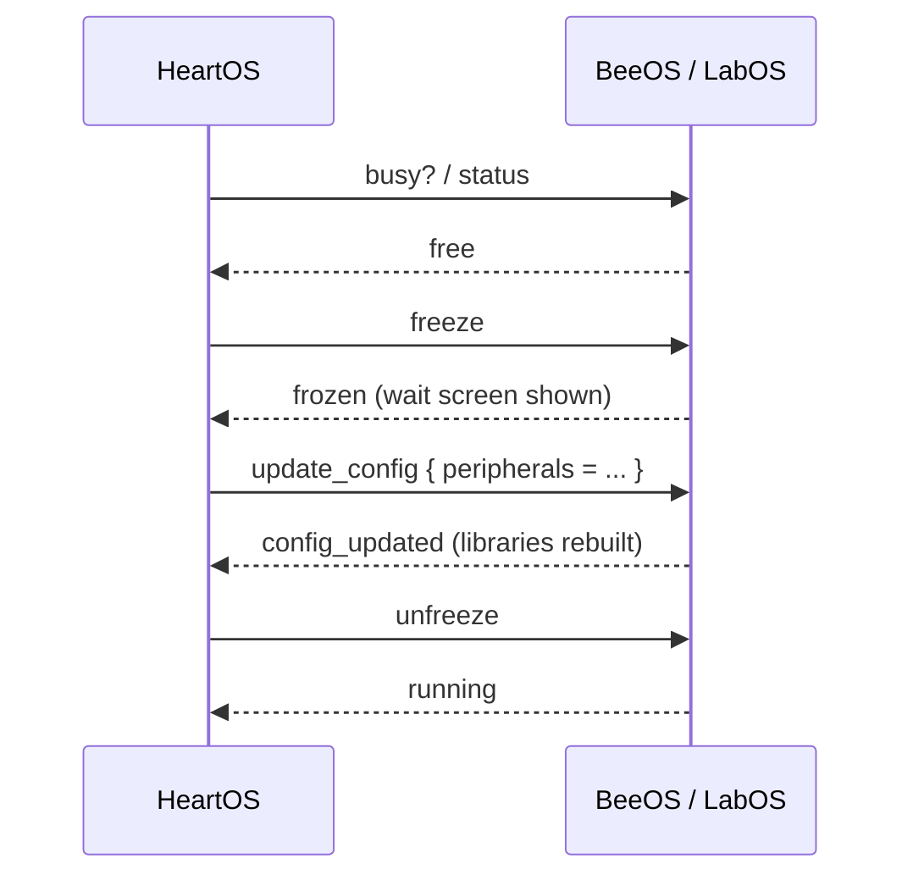

[English](systems.md) | [Русский](systems.ru.md)

# HiveOS — Системы

Этот документ описывает три внутренние системы HiveOS: архитектуру терминалов, конвейер разведения и карту ульев.

- [Архитектура](#архитектура)
- [Разведение](#разведение)
- [Карта ульев](#карта-ульев)

## Архитектура

HiveOS разделён на три роли, чтобы ни один терминал не делал всё сразу.

- **HeartOS** (`2/`) — центр управления. Он владеет реестром устройств в `device_types.lua` (единый источник правды о том, какую периферию можно настроить, сгруппированную в `beeos`, `labos` и `hives`), хранит конфиги как обычные Lua-таблицы и ведёт мастеров настройки и визуальную карту ульев.
- **BeeOS** (`0/`) — владеет экранами ульев. Технический монитор показывает список ульев и детальный экран; один или несколько информационных мониторов дают компактный обзор. Он также отправляет пчёл в лабораторию и принимает их обратно.
- **LabOS** (`1/`) — владеет конвейером разведения и генетики. Он управляет главным лабораторным монитором и четырьмя анимированными мониторами-кнопками: `bee_out`, `gene_upgrade`, `gene_produce` и `breed`.

### Протокол конфигов

HeartOS управляет конфигами BeeOS и LabOS по rednet. Каждый терминал держит именованный сервис rednet (`heartos/main`, `beeos/main`, `labos/main`), поэтому HeartOS находит цель динамически по lookup.

Интерактивное редактирование идёт так:

1. HeartOS спрашивает `busy?` (или `status`). Терминал отвечает `free` или `busy`.
2. Если свободен, HeartOS шлёт `freeze`; терминал отвечает `frozen` и показывает экран ожидания. Если занят, терминал отвечает `wait`, и правка отклоняется.
3. HeartOS шлёт `update_config` с новой таблицей; терминал сохраняет её, пересобирает библиотеки и отвечает `config_updated`.
4. HeartOS шлёт `unfreeze`; терминал отвечает `running`.

Первичная настройка использует `request_config` — он сохраняет конфиг без цикла заморозки.

### Асинхронные воркеры

Вызовы периферии в ComputerCraft могут зависнуть навсегда, а `pcall` от зависания не спасает. HiveOS изолирует этот риск:

- **BeeOS / HiveReader** работает в отдельном потоке через `parallel.waitForAny`. Живые циклы никогда не вызывают `getBlockData` напрямую; они ставят запрос на чтение и рисуют то, что уже есть в памяти. Если чтение зависло, зависает только воркер.
- **LabOS / поток задач** выполняет разведение, производство генов и апгрейды в отдельном потоке, поэтому `sleep()` внутри долгой задачи не может проглотить rednet-сообщения. Главный цикл остаётся единственным владельцем всех событий.

### Передача пчёл

Когда пользователь нажимает лабораторную кнопку на улье, BeeOS освобождает нужные слоты улья, кладёт пустые клетки, ждёт перемещения пчёл, затем забирает заполненные клетки и рассылает `lab_request` с id улья и числом пчёл. Он также пишет файл-локер, чтобы один улей нельзя было отправить дважды. Когда LabOS завершает работу, он шлёт `lab_complete`; BeeOS возвращает пчёл в улей и снимает локер.

## Разведение

Разведением занимается `LabOS/lab_breeding.lua`. Он проводит фиксированный поток из **3 циклов** между **камерой разведения** Productive Bees и **инкубатором**, беря ресурсы из сундука ресурсов и складывая результат в лабораторный сундук.

### Связка блоков

В связку разведения входят:

- **Камера разведения** — держит двух родителей и цветы, производит пчёлодеток.
- **Инкубатор** — выращивает детёныша во взрослую пчелу при подаче медовых лакомств.
- **Сундук ресурсов** — источник подсолнухов, медовых лакомств и пустых клеток; LabOS читает его и перемещает предметы.
- **Лабораторный сундук** — хранит родителей до запуска и принимает взрослых пчёл после.
- **Block Reader** (Advanced Peripherals) на лабораторном сундуке — позволяет LabOS читать пчёл и их гены.
- **Реле** — редстоун-реле, которые LabOS импульсирует там, где машине нужен сигнал.
- **Кликер Just Dire Things** — приводится в действие через своё реле для импульса автоматизации.
- **Интерфейс AE2** — подаёт медовые лакомства на больших пасеках.

### Цикл

1. LabOS читает лабораторный сундук, проверяет, что там ровно две взрослые пчелы-родителя, и переносит их в слоты родителей камеры разведения.
2. В каждом из 3 циклов он кладёт по одному подсолнуху в слоты цветов и по одной пустой клетке в слот детёныша.
3. Камера переносит детёныша в инкубатор; LabOS подаёт медовые лакомства и ждёт появления взрослой пчелы.
4. Каждая взрослая пчела переносится в лабораторный сундук.
5. После циклов LabOS посылает импульс через реле кликера Just Dire Things, чтобы внешняя автоматика вернула родителей.

Пчёл-родителей нельзя извлечь из камеры разведения скриптом, поэтому их возвращает автоматика, а не LabOS. После запуска HiveOS подсвечивает в чате сообщение с просьбой убрать родителей, если автоматика этого не сделала.

> Замени реальным снимком, сохранённым как `docs/screenshots/breeding_setup.png`.

## Карта ульев

Карту ульев строит HeartOS из `hives_map.lua`, где на каждый улей хранится запись с тремя перифериями: сам блок **улья**, **ридер** (Block Reader) и **реле**.

### Сетка

`HeartOS/screens/hive_map_view.lua` рисует сетку, заданную в `heart_config.lua`. Раскладка повторяет физическую пасеку до **96 ульев**:

- **48 ячеек на страницу**, с постраничной навигацией Prev/Next; выбор сохраняется между страницами.
- Страница делится на **три группы по 16**: слоты 1–16 (bottom-up, левая панель), 17–32 (left-right, средняя панель) и 33–48 (top-down, правая панель).
- Каждый улей — фиксированная ячейка **2×1** с двумя цифрами id. Активны и кликабельны только ячейки с цифрами; пустые ячейки рисуются, но не реагируют.

Цвета ячеек: **зелёный** — улей есть на карте, **светло-серый** — пустой слот, **жёлтый** — выбранный.

### Сигналы на реле

Кнопка **Signalise** запускает асинхронный цикл реле, управляемый `HeartOS/hive_signal.lua`. Он включает и выключает реле размеченных ульев повторяющимся циклом, охватывая все стороны каждого реле, чтобы импульс был виден во всех направлениях. Поскольку цикл идёт на таймерах, а не на блокирующих вызовах, монитор остаётся отзывчивым; на время цикла кнопка заблокирована, а чат сообщает оставшиеся секунды.

Именно так сопоставляется ячейка на карте с реальным ульем в мире.

> Замени реальным снимком, сохранённым как `docs/screenshots/hive_setup.png`.

